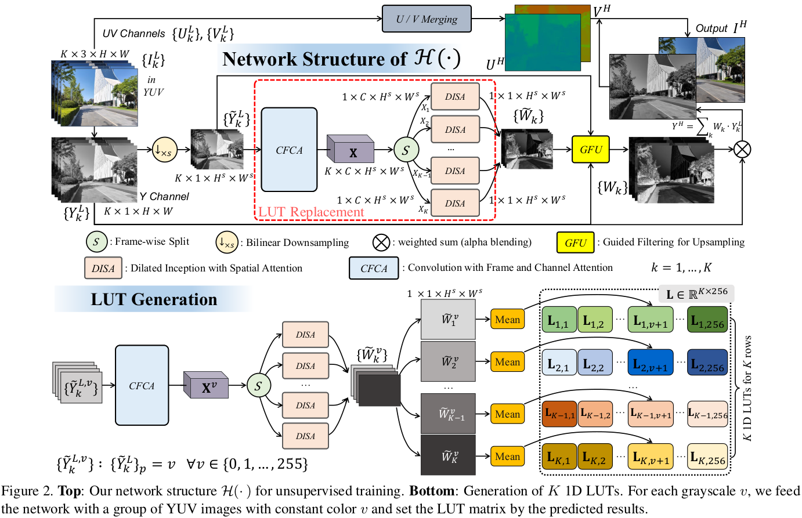

# [ICCV 2023] MEFLUT: Unsupervised 1D Lookup Tables for Multi-exposure Image Fusion [Paper](https://arxiv.org/abs/2309.11847)

<h4 align="center">Ting Jiang<sup>1,*</sup>, Chuan Wang<sup>1</sup>,  Xinpeng Li<sup>1</sup>,  Ru Li<sup>1</sup>,  Haoqiang Fan<sup>1</sup>,  Shuaicheng Liu<sup>2,1,†</sup></center>
<h4 align="center"> 1. Megvii Research, 2. University of Electronic Science and Technology of China</center>
<h6 align="center"> †Corresponding author</center>


## Abstract

In this paper, we introduce a new approach for high-quality multi-exposure image fusion (MEF). We show that the fusion weights of an exposure can be encoded into a 1D lookup table (LUT), which takes pixel intensity value as input and produces fusion weight as output. We learn one 1D LUT for each exposure, then all the pixels from different exposures can query 1D LUT of that exposure independently for high-quality and efficient fusion. Specifically, to learn these 1D LUTs, we involve attention mechanism in various dimensions including frame, channel and spatial ones into the MEF task so as to bring us significant quality improvement over the state-of-the-art (SOTA). In addition, we collect a new MEF dataset consisting of 960 samples, 155 of which are manually tuned by professionals as ground-truth for evaluation. Our network is trained by this dataset in an unsupervised manner. Extensive experiments are conducted to demonstrate the effectiveness of all the newly proposed components, and results show that our approach outperforms the SOTA in our and another representative dataset SICE, both qualitatively and quantitatively. Moreover, our 1D LUT approach takes less than 4ms to run a 4K image on a PC GPU. Given its high quality, efficiency and robustness, our method has been shipped into millions of Android mobiles across multiple brands world-wide.

## Pipeline



## Our Dataset
The  dataset including training and testing dataset can be download from [Baidu Netdisk](Link: https://pan.baidu.com/s/1UvPU10gamBm7kSgDTnNpkA  | 提取码(Extraction code): r2d4 ). The dataset is organized as follow:

```
Training set
|--train
|  |--0  // Sample ID, internal file ranging from EV-4 to EV+2. 
|  |  |--0.jpg  
|  |  |--1.jpg
|  |  |--2.jpg
|  |  |--3.jpg
|  |--1
|  |--2
|  |--3
|  |--...
|--train.txt //  Training set index.

Test set
|--test
|  |--0 // Sample ID, internal file ranging from EV-4 to EV+2. 
|  |  |--0.jpg  
|  |  |--1.jpg
|  |  |--2.jpg
|  |  |--3.jpg
|  |--1
|  |--2
|  |--3
|  |--...
|--test.txt //  Test set index.
```
The indices of the selected 2, 3, and 4 frames in the paper will be updated in the future.

## Usage
### Requirements

This code is developed under 

* Python 3.7.10
* Pytorch 1.12.1
* torchvision 0.13.1
* CUDA 10.0 on Ubuntu 18.04

We strongly recommend you using anaconda to ensure you can get the same results as us. 

Install the require dependencies:

```bash
conda create -n meflut  python=3.7.10
conda activate meflut
pip install -r requirements.txt
```

## Usage
### Testing
```
1. cd codes
2. python main.py # execute in GPU
```
## Citation

If you find this work helpful, please cite our paper:

```
@article{jiang2023meflut,
  title={MEFLUT: Unsupervised 1D Lookup Tables for Multi-exposure Image Fusion},
  author={Jiang, Ting and Wang, Chuan  and Li, Xinpeng and Li, Ru and Fan, Haoqiang and Liu, Shuaicheng},
  journal={arXiv preprint arXiv:2309.11847},
  year={2023}
}
``` 